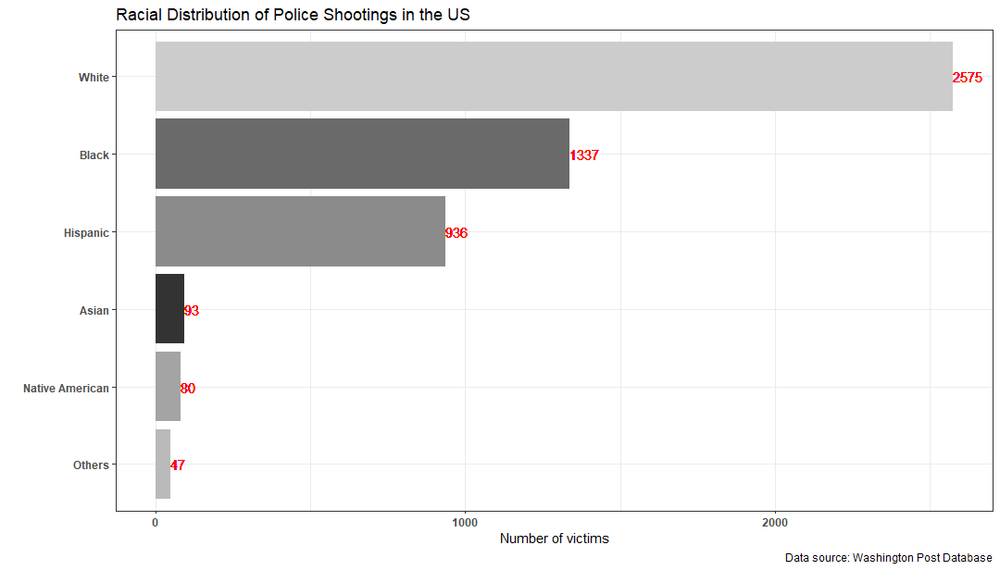

  

```{r setup, include = FALSE}
# set the echo option to FALSE to see how the document looks with the code suppressed
knitr::opts_chunk$set(echo = TRUE)
```

## Instructions and Advice

* **Soft Deadline:** 07 October (4pm)
* **Hard Deadline:** 07 October (8pm)
* There are two questions in this exam. 
* Each question is divided into several parts.
* The points are mentioned in the parentheses in each part.
* Extra-credit parts are in italics.
* This exam accounts for 50% of your final grades.
* At no point of time, you are allowed to ask clarificatory questions in this exam. If you have doubts, make reasonable assumption and proceed with your submission.
* The file must be submitted via Canvas in the following format-
  xxx.Rmd where xxx is your three-digit roll number.
* Some guidelines-

  - Please do not put your folder path anywhere in the code.

  - Please avoid tinkering with the structure of the file.
  
  - Write your code only in the space provided.

  - Write your name and your roll number at the top in the space
    provided.
    
  - I reserve the right to award a zero in case these guidelines 
    are not followed.

* The goal of this exam is to test you on the following:

   - data wrangling

   - data visualization

   - interpretation skills.


## Load Packages

```{r load-packages, message=FALSE}
# load required packages here
pacman::p_load(tidyverse, haven)
```

## Questions 

### Question 1

Before you start answering the questions, please read [this story](https://www.washingtonpost.com/graphics/investigations/police-shootings-database/) on **police shooting** in the US.
The dataset is here.
```{r, message=F, warning=F}
q1data <- read_csv("https://raw.githubusercontent.com/washingtonpost/data-police-shootings/master/fatal-police-shootings-data.csv")
```
Read the description of the variables in the file [here](https://github.com/washingtonpost/data-police-shootings/blob/master/README.md), and answer the following questions.

#### Question 1a
Extract month and year from the column `date`. (**5 points**)

```{r}
#---------------WRITE YOUR CODE HERE#---------------#
```

#### Question 1b
Using `ggplot`, generate a histogram for the variable `age`. (**5 points**)

_Extra-credit: The article highlights the fact that most victims were between 20 and 40 years old. Can you do that in your histogram?_ (**5 points**)
```{r}
#---------------WRITE YOUR CODE HERE#---------------#
```

#### Question 1c
Using `ggplot`, generate a bar chart for the variable `race`. The bar chart must look like the graph shown below. (**10 points**)

```{r, message=F, warning=F, echo=F}

```


```{r}
#---------------WRITE YOUR CODE HERE#---------------#
```

#### Question 1d
Using `ggplot`, recreate the first graph from the article. (**20 points**)

```{r}
#---------------WRITE YOUR CODE HERE#---------------#
```

</br>

### Question 2

Airbnb publishes a lot of data [here](http://insideairbnb.com/get-the-data.html).
In this question, I have shared the url for one such datafile for the city of Amsterdam.

#### Question 2a
Using the object `url`, read the file, and store it into $\texttt{R}$ as a data frame named `airbnb`. (**5 points**)
```{r}
url <- "http://data.insideairbnb.com/the-netherlands/north-holland/amsterdam/2019-09-14/data/listings.csv.gz"

#---------------WRITE YOUR CODE HERE#---------------#

# airbnb <- USE A FUNCTION(url)
```

#### Question 2b

Select the following columns from `airbnb` and replace the data frame. (**5 points**)

 - `neighbourhood`: Locality of the Airbnb property.
 
 - `room_type`: Room type.
 
 - `property_type`: Property type.
 
 - `host_is_superhost`: Whether the host is a superhost.
 
 - `price`: price of the listing.
 
 - `number_of_reviews`: Number of reviews.
 
 - `review_scores_rating`: Review scores.

```{r}
#---------------WRITE YOUR CODE HERE#---------------#

```

#### Question 2c
Which are the five most popular neighbourhood in Amsterdam? The popularity is measured in terms of the number of Airbnb listings. (**5 points**)

```{r}
#---------------WRITE YOUR CODE HERE#---------------#

```


#### Question 2d
Inspect the column `price`, and you will learn that it is currently stored as a character variable. Convert `price` into a numeric variable, and store the new column as `price2` to your dataframe. (**5 points**)

```{r}
#---------------WRITE YOUR CODE HERE#---------------#

```

#### Question 2e
Notice that some listings are very pricey (the value of `price2` is more than $600). Remove these listings from your data, and plot the histogram of `price2` for a neighbourhood of your choice. I have created a sample structure for you. You can copy this to write your answer. (**10 points**)

```{r eval=FALSE}
# DO NOT CHANGE THIS PART OF THE CODE
# COPY THIS IN THE SPACE BELOW. 
ggplot(data = ___, mapping = aes(x = ___)) +
  geom_histogram(binwidth = ___)
```

```{r}
#---------------WRITE YOUR CODE HERE#---------------#
```


#### Question 2f
**Data story**: Take any number of variables ($n>=2$) from the dataset `airbnb` in the following way.

  - Choose (at least) one column from the following set:
  
    - `price2`
    
    - `number_of_reviews`
    
    - `review_scores_rating`

  - Choose (at least) one column from the following set:
  
    - `room_type`
    
    - `host_is_superhost`
    
    - `neighbourhood`
    
and create a graph or a summary table. (**20 points**)

Describe your cool findings in <u>NO MORE THAN 50 WORDS</u>. (**10 points**)

```{r}
#---------------WRITE YOUR CODE HERE#---------------#
```

**WRITE YOUR ANSWER HERE**

## COLLABORATORS
```{r}
#---------------WRITE YOUR CODE HERE#---------------#
```