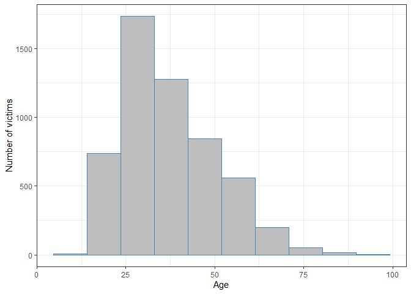
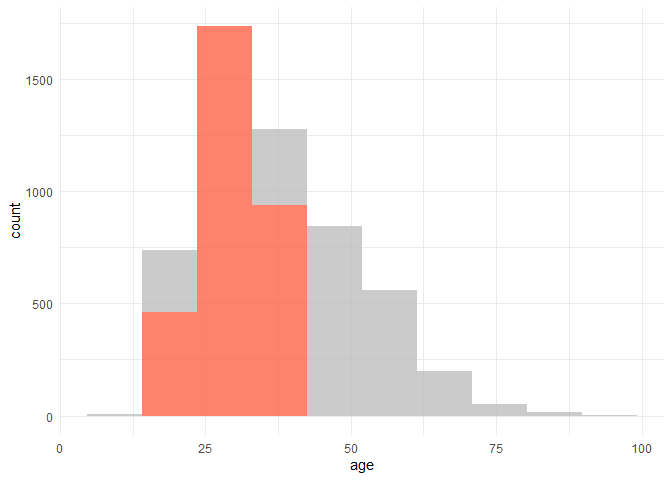
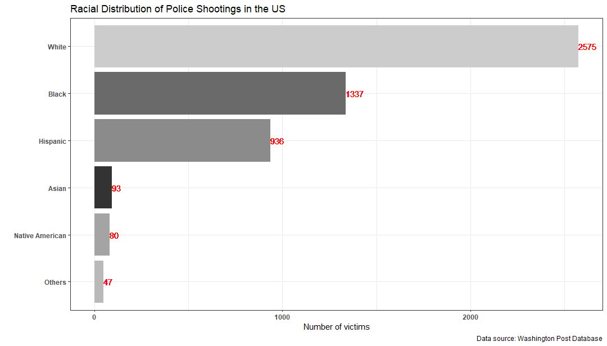
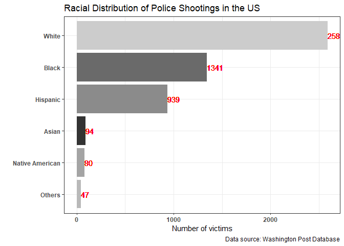
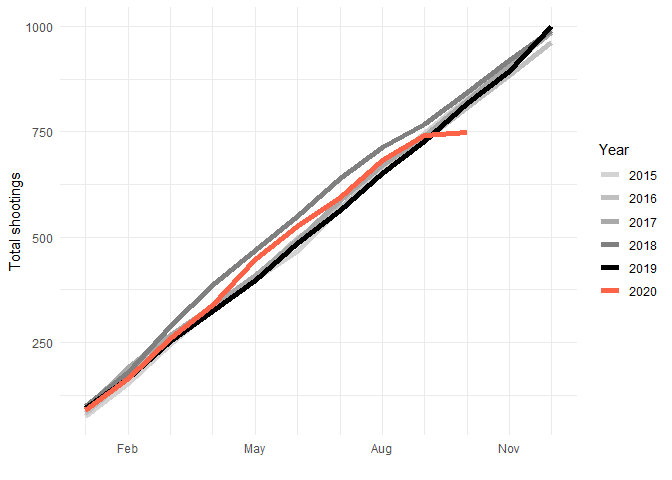
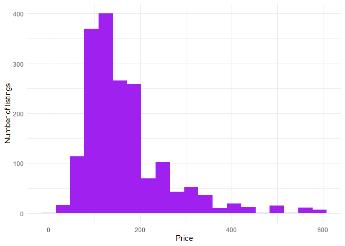
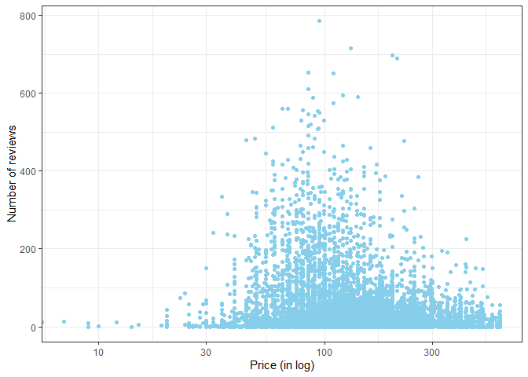

  


## Instructions and Advice

* **Soft Deadline:** 07 October (4pm)
* **Hard Deadline:** 07 October (8pm)
* There are two questions in this exam. 
* Each question is divided into several parts.
* The points are mentioned in the parentheses in each part.
* Extra-credit parts are in italics.
* This exam accounts for 50% of your final grades.
* At no point of time, you are allowed to ask clarificatory questions in this exam. If you have doubts, make reasonable assumption and proceed with your submission.
* The file must be submitted via Canvas in the following format-
  xxx.Rmd where xxx is your three-digit roll number.
* Some guidelines-

  - Please do not put your folder path anywhere in the code.

  - Please avoid tinkering with the structure of the file.
  
  - Write your code only in the space provided.

  - Write your name and your roll number at the top in the space
    provided.
    
  - I reserve the right to award a zero in case these guidelines 
    are not followed.

* The goal of this exam is to test you on the following:

   - data wrangling

   - data visualization

   - interpretation skills.


## Load Packages


```r
# load required packages here
pacman::p_load(tidyverse, haven, data.table)
```

## Questions 

### Question 1

Before you start answering the questions, please read [this story](https://www.washingtonpost.com/graphics/investigations/police-shootings-database/) on **police shooting** in the US.
The dataset is here.

```r
q1data <- read_csv("https://raw.githubusercontent.com/washingtonpost/data-police-shootings/master/fatal-police-shootings-data.csv")
```

Read the description of the variables in the file [here](https://github.com/washingtonpost/data-police-shootings/blob/master/README.md), and answer the following questions.

#### Question 1a
Extract month and year from the column `date`. (**5 points**)


```r
#---------------WRITE YOUR CODE HERE#---------------#
q1data %>% mutate(mth = lubridate::month(date),
              yr = lubridate::year(date)) %>%
  relocate(mth, yr) %>%
  head()
```

```
## # A tibble: 6 x 19
##     mth    yr    id name  date       manner_of_death armed   age gender race 
##   <dbl> <dbl> <dbl> <chr> <date>     <chr>           <chr> <dbl> <chr>  <chr>
## 1     1  2015     3 Tim ~ 2015-01-02 shot            gun      53 M      A    
## 2     1  2015     4 Lewi~ 2015-01-02 shot            gun      47 M      W    
## 3     1  2015     5 John~ 2015-01-03 shot and Taser~ unar~    23 M      H    
## 4     1  2015     8 Matt~ 2015-01-04 shot            toy ~    32 M      W    
## 5     1  2015     9 Mich~ 2015-01-04 shot            nail~    39 M      H    
## 6     1  2015    11 Kenn~ 2015-01-04 shot            gun      18 M      W    
## # ... with 9 more variables: city <chr>, state <chr>,
## #   signs_of_mental_illness <lgl>, threat_level <chr>, flee <chr>,
## #   body_camera <lgl>, longitude <dbl>, latitude <dbl>,
## #   is_geocoding_exact <lgl>
```

#### Question 1b
Using `ggplot`, generate a histogram for the variable `age`. (**5 points**)

_Extra-credit: The article highlights the fact that most victims were between 20 and 40 years old. Can you do that in your histogram?_ (**5 points**)

```r
#---------------WRITE YOUR CODE HERE#---------------#
# Code for 1b
q1data %>% ggplot(aes(age))+
  geom_histogram(bins = 10, na.rm = T, fill = "gray",
                 color = "steelblue") +
  labs(x = "Age",
       y = "Number of victims") + 
  theme_bw()
```




```r
# Extra-credit question

ggplot(q1data, aes(age)) + 
  geom_histogram(aes(fill=age >= 20 & age < 40), na.rm = T,
                 alpha = 0.8, bins = 10) +
  scale_fill_manual(values = c("grey", "tomato")) +
  theme_minimal() + 
  theme(legend.position = "none")
```




#### Question 1c
Using `ggplot`, generate a bar chart for the variable `race`. The bar chart must look like the graph shown below. (**10 points**)




```r
#---------------WRITE YOUR CODE HERE#---------------#
q1data %>%  filter(is.na(race)==F) %>%
  group_by(race) %>%
  add_tally() %>%
  ggplot(aes(reorder(race, n),fill = race)) + 
  geom_bar() +
  geom_text(aes(x = race, y = n, label = n, hjust = 0), color = "red") +
  scale_fill_grey() + 
  scale_x_discrete(labels = rev(c("White", "Black", "Hispanic",
                                  "Asian", "Native American", "Others")
                                )) +
  coord_flip() +
  labs(x = "",
       y = "Number of victims",
       title = "Racial Distribution of Police Shootings in the US",
       caption = "Data source: Washington Post Database") +
  theme_bw() +
  theme(legend.position = "none",
        axis.text.x = element_text(face = 'bold'),
        axis.text.y = element_text(face = 'bold'))
```



#### Question 1d
Using `ggplot`, recreate the first graph from the article. (**20 points**)


```r
#---------------WRITE YOUR CODE HERE#---------------#
df2 <- q1data %>% group_by(lubridate::year(date),
                       lubridate::month(date)) %>%
  summarise(n()) %>%
  janitor::clean_names() %>%
  mutate(killing = cumsum(n)) %>%
  select(year = lubridate_year_date,
         month = lubridate_month_date,
         num_killed = n,
         killing) %>%
  mutate(date = lubridate::ymd(paste0(year,"-", month,"-", "01")))

lab <- factor(c("", "Feb", "", "","May", "","", "Aug","","", "Nov",""))

df2 %>% ggplot(aes(lubridate::month(date, label=TRUE, abbr=TRUE), 
                   killing,
                   group = factor(year),
                   color = factor(year))) +
  scale_colour_manual(values = 
                        c("#D3D3D3","#C0C0C0","#A9A9A9",
                          "#808080","#000000", "tomato")) + 
  geom_line(lwd = 2,
            alpha = 1) +
  scale_x_discrete(labels = lab) +  
  labs(y = "Total shootings",
       x = "",
       color = "Year") + 
  theme_minimal() 
```



</br>

### Question 2

Airbnb publishes a lot of data [here](http://insideairbnb.com/get-the-data.html).
In this question, I have shared the url for one such datafile for the city of Amsterdam.

#### Question 2a
Using the object `url`, read the file, and store it into $\texttt{R}$ as a data frame named `airbnb`. (**5 points**)

```r
url <- "http://data.insideairbnb.com/the-netherlands/north-holland/amsterdam/2019-09-14/data/listings.csv.gz"

#---------------WRITE YOUR CODE HERE#---------------#

airbnb <- fread(url)
```

#### Question 2b

Select the following columns from `airbnb` and replace the data frame. (**5 points**)

 - `neighbourhood`: Locality of the Airbnb property.
 
 - `room_type`: Room type.
 
 - `property_type`: Property type.
 
 - `host_is_superhost`: Whether the host is a superhost.
 
 - `price`: price of the listing.
 
 - `number_of_reviews`: Number of reviews.
 
 - `review_scores_rating`: Review scores.


```r
#---------------WRITE YOUR CODE HERE#---------------#
airbnb2 <- airbnb %>% 
  select(neighbourhood, price,host_is_superhost,
              room_type, property_type, review_scores_rating,
              number_of_reviews)
head(airbnb2)
```

```
##          neighbourhood   price host_is_superhost       room_type property_type
## 1:      Indische Buurt  $59.00                 t    Private room     Apartment
## 2:      Grachtengordel  $80.00                 f    Private room     Townhouse
## 3:      Grachtengordel $125.00                 f Entire home/apt     Apartment
## 4: Westelijke Eilanden $155.00                 t    Private room     Houseboat
## 5:   Amsterdam Centrum  $75.00                 t    Private room     Apartment
## 6:   Amsterdam Centrum  $55.00                 t    Private room     Apartment
##    review_scores_rating number_of_reviews
## 1:                   98               269
## 2:                   88               288
## 3:                  100                 3
## 4:                   99               200
## 5:                   97               295
## 6:                   95               446
```

#### Question 2c
Which are the five most popular neighbourhood in Amsterdam? The popularity is measured in terms of the number of Airbnb listings. (**5 points**)


```r
#---------------WRITE YOUR CODE HERE#---------------#
airbnb2 %>% group_by(neighbourhood) %>%
  tally() %>% arrange(-n) %>%
  slice(1:5)
```

```
## # A tibble: 5 x 2
##   neighbourhood      n
##   <chr>          <int>
## 1 Oud-West        3394
## 2 Oud-Zuid        1823
## 3 Bos en Lommer   1193
## 4 Grachtengordel  1191
## 5 Indische Buurt  1024
```


#### Question 2d
Inspect the column `price`, and you will learn that it is currently stored as a character variable. Convert `price` into a numeric variable, and store the new column as `price2` to your dataframe. (**5 points**)


```r
#---------------WRITE YOUR CODE HERE#---------------#
airbnb3 <- airbnb2 %>%
  mutate(price2 = 
           as.numeric(gsub("\\,", "",gsub("\\$", "", price)
                           )))
summary(airbnb3$price2)
```

```
##    Min. 1st Qu.  Median    Mean 3rd Qu.    Max. 
##     0.0    99.0   130.0   160.4   180.0  8915.0
```

#### Question 2e
Notice that some listings are very pricey (the value of `price2` is more than $600). Remove these listings from your data, and plot the histogram of `price2` for a neighbourhood of your choice. I have created a sample structure for you. You can copy this to write your answer. (**10 points**)


```r
# DO NOT CHANGE THIS PART OF THE CODE
# COPY THIS IN THE SPACE BELOW. 
ggplot(data = ___, mapping = aes(x = ___)) +
  geom_histogram(binwidth = ___)
```


```r
#---------------WRITE YOUR CODE HERE#---------------#
ggplot(data = filter(airbnb3, 
                     price2<= 600 & 
                     neighbourhood == "Oud-Zuid"), 
       mapping = aes(x = price2)) +
  geom_histogram(fill = "purple", bins=20) + 
  labs(x = "Price",
       y = "Number of listings") +
  theme_minimal()
```




#### Question 2f
**Data story**: Take any number of variables ($n>=2$) from the dataset `airbnb` in the following way.

  - Choose (at least) one column from the following set:
  
    - `price2`
    
    - `number_of_reviews`
    
    - `review_scores_rating`

  - Choose (at least) one column from the following set:
  
    - `room_type`
    
    - `host_is_superhost`
    
    - `neighbourhood`
    
and create a graph or a summary table. (**20 points**)

Describe your cool findings in <u>NO MORE THAN 280 CHARACTERS</u>. (**10 points**)


```r
#---------------WRITE YOUR CODE HERE#---------------#
ggplot(filter(airbnb3, price2 <=600), 
       aes(price2, number_of_reviews)) + 
  geom_point(color = "skyblue") + 
  scale_x_log10() + 
  labs(x = "Price (in log)",
       y = "Number of reviews")+
  theme_bw() + 
  theme(legend.position = "none")
```




**WRITE YOUR ANSWER HERE**

There is a negative correlation between price and the number of reviews.

## COLLABORATORS

```r
#---------------WRITE YOUR CODE HERE#---------------#
```
