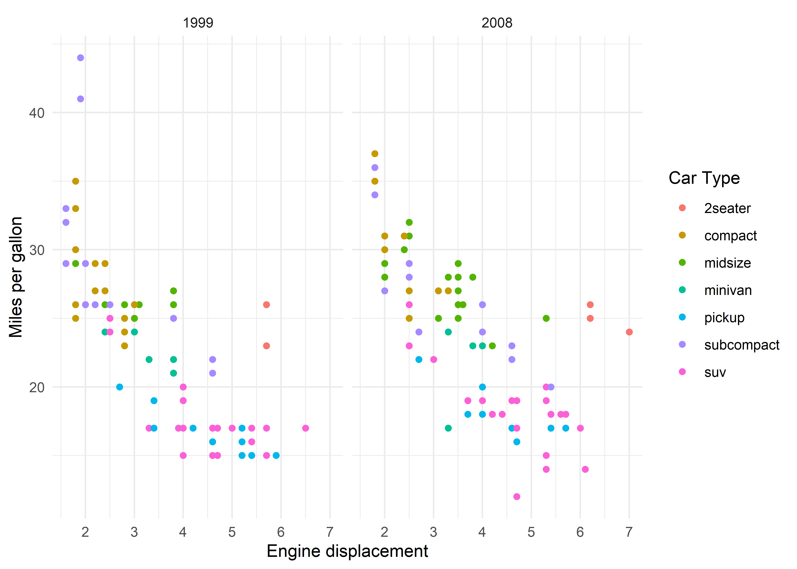
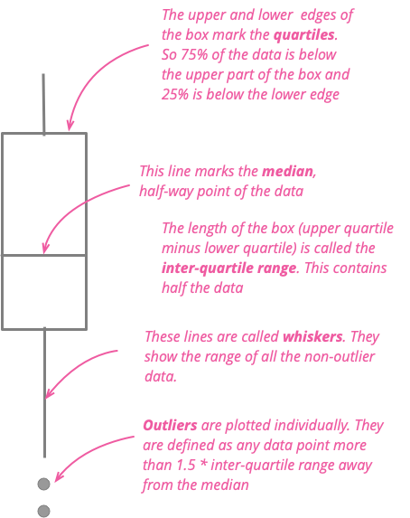

```{r setup, include=FALSE}
library(pacman)
pacman::p_load(tidyverse, kableExtra, readxl, tufte)
knitr::opts_chunk$set(echo = TRUE, cache = TRUE, dpi=300)
# Define pink color
red_pink <- "#e64173"
turquoise <- "#20B2AA"
orange <- "#FFA500"
red <- "#fb6107"
blue <- "#3b3b9a"
green <- "#8bb174"
grey_light <- "grey70"
grey_mid <- "grey50"
grey_dark <- "grey20"
purple <- "#6A5ACD"
slate <- "#314f4f"
set.seed(921)
```

You will learn how to create pretty graphs using $\texttt{R}$'s outstanding **`ggplot`**.


# Graphics in Base R 

We will first familiarize ourselves with the base $\texttt{R}$ command for generating plots: `plot()`. This function has the following arguments:

  - `x`: the variable on the x-axis
  
  - `y`: the variable on the y-axis
  
  - `type`: the type of the plot (p, l, h, etc.)
  
  - `main`: a title for the graph
  
  - `sub`: a subtitle 
  
  - `xlab`: a title for the x-axis
  
  - `ylab`: a title for the y-axis
  
  - `col`: color for the graph

## Scatter-plot
Let's plot `hwy` vs `displ` from the dataset `mpg`. 
We plot `displ` on the x-axis, and `hwy` on the y-axis.


```{R base-scatter}
plot(mpg$displ, mpg$hwy)
grid()
```


A much cleaner output will have the following elements: 
  
   - **Labels for axes**
   
   - **Title for the graph**
   
   - **Nice colour for the points**

Let's do this.

```{R base-scatter-refined}
plot(mpg$displ, mpg$hwy, 
     col = "red",                                # add color
     main = "My first graph in R",               # title
     xlab = "Engine displacement",               # x-axis label
     ylab = "Miles per gallon")                  # y-axis label
grid()
```


## Histogram

The function is called `hist()`. We are going to plot miles per gallon (`hwy`) from `mpg`. 

```{r histbase}
hist(mpg$hwy, 
     col = 'steelblue', 
     border = 'white', 
     main = '',
     xlab = 'Miles per gallon')
```

## Line graph

We will plot unemployment over time using `economics` dataset.

```{r,fig.retina=slate}
plot(economics$date,
     economics$unemploy,
     type = "l",
     ylab = "Number of unemployed (in '000)",
     xlab = "",
     col = "skyblue",
     main = "")
grid()
```

# ggplot

## Introduction
The trouble with the base $\texttt{R}$ graphics function is that it's not very customizable, and the features are limited. `ggplot` is a powerful alternative to `plot`. The package and the underlying philosophy of the grammar of graphics is routinely used in the work that appears in major media organizations. A good example is BBC's `bbplot`.

```{r, echo=FALSE, out.width="100%"}
knitr::include_graphics("bbplot_example_plots.png")
```
</br>
</br>
</br>

`ggplot` represents the grammar of the graphics with the following components or layers:
 
 - <span style="color:purple">**Data**</span> (`data`)
 - <span style="color:purple">**Aesthetics mappings**</span> (`aes`)
 - <span style="color:purple">**Geometric objects**</span> (`geom`)
 - <span style="color:purple">**Scales**</span>
 - <span style="color:purple">**Statistics**</span>
 - <span style="color:purple">**Coordinates**</span>
 - <span style="color:purple">**Labels**</span>
 - <span style="color:purple">**Facets**</span>
 
One by one (in no particular order), we will discuss each of these layers to produce a simple graph. 

## Data
 - This grammar requires tidy data.
 - You are already familiar with `dplyr` and `tidyr`.
The code that you are going to write is the following:
`ggplot(mpg)` or `mpg %>% ggplot()`. Do not run this line in $\texttt{R}$.

## Aesthetics mapping
  - This is the link between the type of graph that you want and the data (the first grammar).
  - These are the columns you want to plot!
The syntax that we will use to incorporate this new grammar is: `ggplot(data = mpg, mapping = aes(x=displ, y=hwy))`
If you just copy-paste this command into your console, you will see a blank graph. 

```{r, echo = F, out.width='100%'}
ggplot(data = mpg, mapping = aes(displ, hwy))
```


## Geometry
 - What is the type of plot that you want to show?
 - It is represented by `geoms_`
The table below shows the different types of `geoms`.

| Type | `geom` |
|------|--------|
| Scatterplot | `geom_point()` |
| Line  | `geom_line()`, `geom_path()`  |
| Bar   | `geom_bar()`, `geom_col()` |
| Histogram | `geom_histogram()` |
| Regression | `geom_smooth()` |
| Boxplot | `geom_boxplot()` |
| Text | `geom_text()` |
| Density | `geom_density()` |


We know that we want to show a scatterplot for miles per gallon versus engine displacement. How do we do this? We use <span style="color:orange">**+**</span> to add any new layer. The **geom** that will get you the scatterplot is `geom_point()`.
```{r, out.width='100%'}
mpg %>% ggplot(mapping = aes(x = displ, y = hwy)) + 
  geom_point()
  
```


## Labels
Now that we have created this scatter, we want to add three things:
 
  - a label for y-axis.
  - a label for x-axis.
  - a title (and a subtitle).
The layer that will be added to our ggplot is `labs()`.
```{r, out.width='100%'}
mpg %>% ggplot(mapping = aes(x = displ, 
                             y = hwy)) + 
  geom_point() + 
  labs(x = "Engine displacement",               # x-axis label
       y = "Miles per gallon",                  # y-axis label
       title = "Some catchy title",             # Title
       subtitle = "a provocative subtitle",     # Subtitle
       caption = "add your data source here")   # Footnote
```


## Mapping colours
Adding colour to scatterplot is easy. You need to add the argument `colour` to the `geom` layer. In the example below, I have added `color = "purple`. 

```{r, out.width='100%'}
mpg %>% ggplot(mapping = aes(x = displ, 
                             y = hwy)) + 
  geom_point(color = "purple") + 
  labs(x = "Engine displacement",               # x-axis label
       y = "Miles per gallon",                  # y-axis label
       title = "Some catchy title",             # Title
       subtitle = "a provocative subtitle",     # Subtitle
       caption = "add your data source here")   # Footnote
```

You can also vary color for each point by a variable of your choice. Let me elaborate. Suppose that you want to plot miles per gallon vs engine displacement, but each point must be color-coded by the type of the car.
We can do this by bringing the `color` argument into the aesthetics.
```{r, out.width='100%'}
mpg %>% ggplot(mapping = aes(x = displ, 
                             y = hwy,
                             color = class)) + 
  geom_point() + 
  labs(x = "Engine displacement",               # x-axis label
       y = "Miles per gallon",                  # y-axis label
       title = "Some catchy title",             # Title
       subtitle = "a provocative subtitle",     # Subtitle
       caption = "add your data source here")   # Footnote
```


## Shape and Size

 - You can change the shape of the point by adding the argument `shape`
   to `geom`. You will need to enter an integer value.

 - You can increase or reduce the size of the points by changing the
   values for the argument `size` of the layer `geom`.


```{r, out.width='100%'}
mpg %>% ggplot(mapping = aes(x = displ, 
                             y = hwy,
                             color = class)) + 
  geom_point(shape = 18,                        # shape
             size = 5                           # size
             ) + 
  labs(x = "Engine displacement",               # x-axis label
       y = "Miles per gallon",                  # y-axis label
       title = "Some catchy title",             # Title
       subtitle = "a provocative subtitle",     # Subtitle
       caption = "add your data source here")   # Footnote
```

## Transparency

You can use the parameter `alpha` to reduce or increase the opacity of the plot. In the example below, we plot `x` and `y` in two ways. Figure 1 is standard `ggplot`, whereas Figure 2 is the output when you set `alpha = 0.2` within geom. 

:::::: {.columns}
::: {.column width="48%" data-latex="{0.48\textwidth}"}
Figure 1:
```{r, out.width='100%'}
df <- data.frame(x = rnorm(5000), 
                 y = rnorm(5000))
df %>% ggplot(aes(x,y)) + 
  geom_point(colour = "purple")
```

:::
::: {.column width="4%" data-latex="{0.04\textwidth}"}
\ 

<!-- an empty Div (with a white space), serving as
a column separator -->
:::
:::::: {.column width="48%" data-latex="{0.48\textwidth}"}
Figure 2:

```{r, out.width='100%'}
df <- data.frame(x = rnorm(5000), 
                 y = rnorm(5000))
df %>% ggplot(aes(x,y)) + 
  geom_point(colour = "purple", alpha = 0.2)
```
:::
::::::
\  


**NOTE**: whenever you want any of these parameters- `shape`, `size`, `color`, `alpha`- to be assigned to a variable, you need to move it inside `aes()`. 


## Facets
You can divide any graph into a set of graphs by add `facet_grid()` layer to `ggplot`. For example, we can plot `hwy` versus `displ` by the number of cylinders `cyl`. Recall that `cyl` takes the values 4,5,6, and 8. For each of these values, we are going to plot miles per gallon versus engine displacement.

```{r, out.width='100%'}
ggplot(mpg, aes(displ, hwy)) + 
  geom_point(colour = "purple") + 
  facet_grid(~factor(cyl))
```
</br>

Some points here-
 
  - `facet_grid` will work when you add factor variables. 
     See that we have added `cyl` as a categorical variable in the
     graph.
  
  - Any grid can be divided into rows and columns. In the example above,
    we have added variable after `~` which means that $\texttt{R}$ will
    create columnwise grids. Try modifying this to
    `facet_grid(factor(cyl)~.)`, and you will see that plots will be
    stacked vertically.


## Themes
With themes, you can change the outline of the plot. You can customize axes, background, and legends. The options inside `theme()` are:
 
  - `axis`: axis title, ticks, and lines.

  - `legend`: customize legend.

  - `panel`: change the plot area.

  - `plot`: the entire graph.

  - `strip`: facet labels.

While I recommend that you explore how to create custom themes, it should suffice that you use one of the themes bundled with `ggplot`. 
The graphs below are outputs from two specific themes. 

:::::: {.columns}
::: {.column width="48%" data-latex="{0.48\textwidth}"}
**`theme_bw()`**
```{R, out.width = '100%', message = F, warning = F}
ggplot(data = mpg)+
  aes(x = displ,
      y = hwy,
      colour = class)+
  geom_point()+
  facet_wrap(~year)+
  labs(x = "Engine displacement",
       y = "Miles per gallon",
       color = "Car Type")+
  theme_bw()
```

:::
::: {.column width="4%" data-latex="{0.04\textwidth}"}
\ 

<!-- an empty Div (with a white space), serving as
a column separator -->
:::
:::::: {.column width="48%" data-latex="{0.48\textwidth}"}

**`theme_minimal()`**
```{R figm, out.width = '100%', message = F, warning = F}
ggplot(data = mpg)+
  aes(x = displ,
      y = hwy,
      colour = class)+
  geom_point()+
  facet_wrap(~year)+
  labs(x = "Engine displacement",
       y = "Miles per gallon",
       color = "Car Type")+
  theme_minimal()
```
:::
::::::
\  


## Scale

With scale, you can take control of the size, the color, and labels of the plot (which is currently already been done for you in some default manner). It's an awesome tool to customize a graph.


> Scales in ggplot2 control the mapping from data to aesthetics. They   take your data and turn it into something that you can see, like size, colour, position or shape. They also provide the tools that let you interpret the plot: the axes and legend.
`r tufte::quote_footer('-- Hadley Wickham (ggplot2: Elegant Graphics for Data Analysis)')`


</br>

```{r, include=F}

```

Taking cue from Master Hadley, we are going to modify the figure from the theme subsection. The color of points is mapped to the column `class`, but the colours are chosen by default. We will choose our own set of colours^[this is a good resource on colours in $\texttt{R}$:  https://data.library.virginia.edu/setting-up-color-palettes-in-r/] and create the plot. We will add a new layer <span style="color:purple">`scale_colour_manual()`</span> to our plot.
```{r figm2, out.width='100%', warning=F, message=F}
cbp <- c("#999999", "#E69F00", "#56B4E9", "#009E73",
          "#F0E442", "#0072B2", "#D55E00") # a set of seven colours
p <- ggplot(data = mpg)+
  aes(x = displ,
      y = hwy,
      colour = class)+
  geom_point(size = 4,
             shape = 18)+
  facet_wrap(~year)+
  labs(x = "Engine displacement",
       y = "Miles per gallon",
       color = "Car Type")+
  theme_bw()
p + scale_color_manual(values = cbp)
```

## geoms revisited

Finally, we are going to just wrap this section up by plotting more `geom` types^[As an aside, this is a nice blog post on comparing groups (I have added the nice boxplot explainer from this piece) that you should read- https://martinfowler.com/articles/dont-compare-averages.html].

### Histogram
You can plot the distribution of a continuous variable using `geom_histogram`. In the example below, we have plotted the distribution of `hwy` from the dataset `mpg`. The key arguments you need to think about are:
  
  - bins: Number of bins (the default is 30).
  
  - binwidth: The width of the bins.

```{r gghist, out.width='80%', message=F}
mpg %>%
  ggplot(aes(x = hwy)) +
  geom_histogram(bins = 8, color = "seagreen3", fill = "grey90")+
  xlab("Miles per gallon") +
  labs(title = "The distribution of miles per gallon \n for cars sold in the US",
       subtitle = "From the world-famous fuel economy dataset") +
    theme_bw()
```

### Bar Chart
Let me do this via an example. Take the `mpg` dataset and think about the following table which tells us the count of each car type.

```{r classTab, message=F}
table(mpg$class) %>% 
  kable(col.names = c("Car Type","Count")) %>%
  kable_minimal()
```

We will convert this table into a bar chart using `geom_bar()`. The syntax will be similar to `geom_histogram` where we put only one variable inside the aesthetics mapping^[The resulting graph is not the best way to visualize this variable. We should arrange the bars in ascending or descending order of the values.]

```{r barchart, out.width='100%', message=F}
mpg %>% ggplot(aes(x = class)) +
  geom_bar(fill = cbp)+
  coord_flip()+         # flip the axes
  labs(x = "Car Type",
       y = "Number of vehicles")+
  theme_bw()
```

### Boxplot

We can create boxplot in `ggplot` by using `geom_boxplot`.

If you are wondering how to read a boxplot, here's a simple illustration.

```{r, echo = F, out.width='50%'}

```

In this example, we have plotted the distribution of miles per gallon by car type.
```{r, out.width='100%'}
mpg %>%
  ggplot(aes(x = class, y = hwy)) + 
  geom_boxplot(fill = cbp) + 
  labs(x = "Car Type",
       y = "Miles per gallon")+
  theme_bw()

```

## What else?

In this set of notes, I have omitted discussion on statistics, and covered a limited types of graphs. Once you have gone through these notes, you should explore the following material (all freely available!).
  
 - **Kieran Healy's [Data Visualization: A Practical Guide](http://socviz.co/)**
 
 - **Claus Wilke's [Fundamentals of Data Visualization](https://serialmentor.com/dataviz)**
 
 - PolicyViz [Better Presentations](https://policyviz.com/) 


# Done for the day
```{r gif_example, echo = FALSE, out.width='100%'}
fmt = rmarkdown::default_output_format(knitr::current_input())$name
if (fmt == "html_document"){
  knitr::include_graphics('silly05.gif')
}
if (fmt == "pdf_document"){
  message("Sorry, this silly GIF is only available in the the HTML version of the notes.")
}
```
